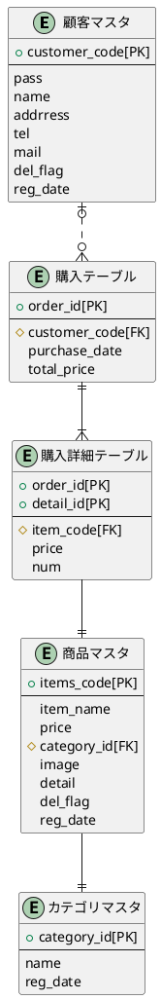

```puml
@startuml
entity "顧客マスタ" {
  +customer_code[PK]
  --
  pass
  name
  addrress
  tel
  mail
  del_flag
  reg_date
  }
  
  entity "購入テーブル" {
  +order_id[PK]
  --
  # customer_code[FK]
  purchase_date
  total_price
  }
  
  entity "購入詳細テーブル" {
  +order_id[PK]
  +detail_id[PK]
  --
  # item_code[FK]
  price
  num
  }
  
  entity "商品マスタ" {
  +items_code[PK]
  --
  item_name
  price
  # category_id[FK]
  image
  detail
  del_flag
  reg_date
  }
  
  entity "カテゴリマスタ" {
+category_id[PK]
--
name
reg_date
}

顧客マスタ |o..o{ 購入テーブル 
購入テーブル ||--|{ 購入詳細テーブル
購入詳細テーブル --|| 商品マスタ
商品マスタ --|| カテゴリマスタ
@enduml
```
