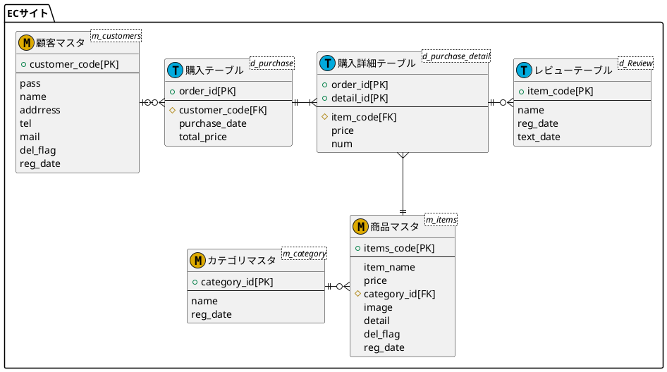

```puml
@startuml
package "ECサイト" as target_system {
entity "顧客マスタ" <m_customers><<M,DDAA00>>{
  +customer_code[PK]
  --
  pass
  name
  addrress
  tel
  mail
  del_flag
  reg_date
  }
  
  entity "購入テーブル"<d_purchase><<T,00AADD>>{
  +order_id[PK]
  --
  # customer_code[FK]
  purchase_date
  total_price
  }
  
  entity "購入詳細テーブル" <d_purchase_detail><<T,00AADD>> {
  +order_id[PK]
  +detail_id[PK]
  --
  # item_code[FK]
  price
  num
  }
  
  entity "商品マスタ"<m_items><<M,DDAA00>> {
  +items_code[PK]
  --
  item_name
  price
  # category_id[FK]
  image
  detail
  del_flag
  reg_date
  }
  
  entity "カテゴリマスタ" <m_category><<M,DDAA00>> {
+category_id[PK]
--
name
reg_date
}
entity "レビューテーブル"<d_Review><<T,00AADD>>{
+item_code[PK]
--
name
reg_date
text_date
}
}

顧客マスタ |o-ri-o{ 購入テーブル 
購入テーブル ||-ri-|{ 購入詳細テーブル
購入詳細テーブル ||-ri-o{レビューテーブル
購入詳細テーブル }-do-|| 商品マスタ
商品マスタ }o-le-|| カテゴリマスタ

@enduml
```
