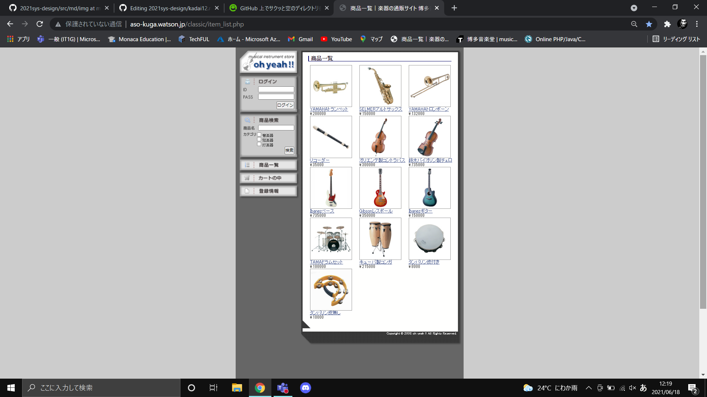

### 画面詳細図
## トップページ
### プロトタイプは以下のリンク先
[プロトタイプ](https://www.figma.com/file/L8OvFbHtp1rBlo4m49IPWs/Untitled?node-id=1%3A2)
*****

*****
補足：対応DBの列はDB設計後、〇を対応するテーブル・カラム名に差し替えること。

|ID|要素|内容|アクション|イベント|対応DB|
|--|----|----|----------|--------|-----|
|1 |バナー|サイト名表示|-|-       |-    |
|2 |メニュー|ボタン|クリック|メニューへ移行|-|
|3|検索欄|テキスト画像|-       |-  |
|4|商品名|テキスト表示|-|-       |-     |
|5|商品名|入力欄|テキスト入力|-   |〇|
|6|検索|ボタン|クリック|検索処理実行|〇|
|7|カートの中|画像ボタン|クリック|カートの中へ移行|〇|
|8|商品画像|画像リンク|クリック|商品詳細へ移行|〇|
|9|商品名|テキストリンク|クリック|商品詳細へ移行|〇|
|10|価格|テキスト表示|-    |-        |〇|

