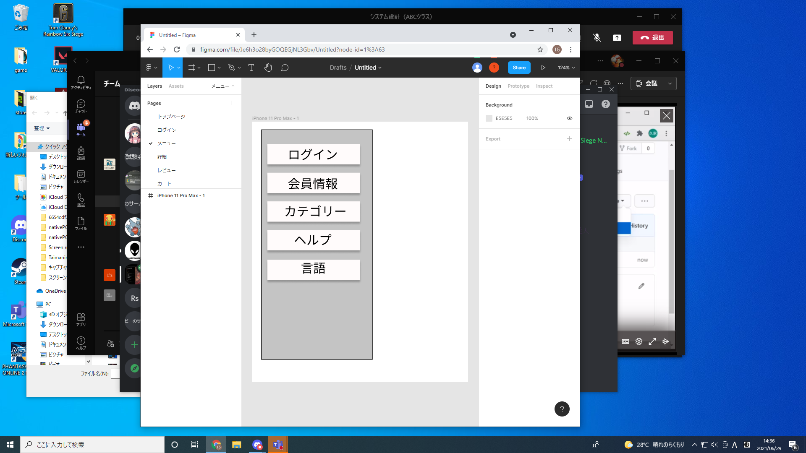

### 画面詳細図
## メニュー
### プロトタイプは以下のリンク先
[プロトタイプ](https://www.figma.com/file/Je6h3o28byGOQEGjNL3Gbv/Untitled?node-id=1%3A63)
*****

*****
補足：対応DBの列はDB設計後、〇を対応するテーブル・カラム名に差し替えること。

|ID|要素|内容|アクション|イベント|対応DB|
|--|----|----|----------|--------|-----|
|2|ログイン|ボタン|クリック|ログインへ移行|-    |
|8|会員情報|ボタン|クリック|会員登録へ移行|-    |
|9|カテゴリ|ボタン|クリック|カテゴリーに移行|-   |

